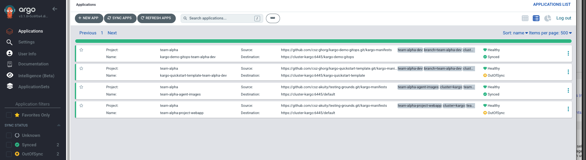
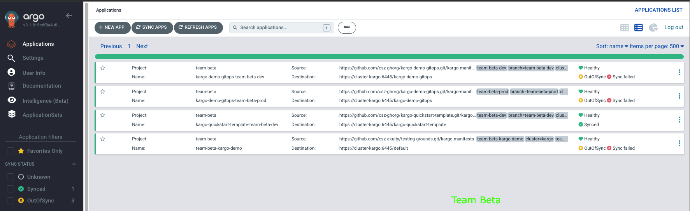
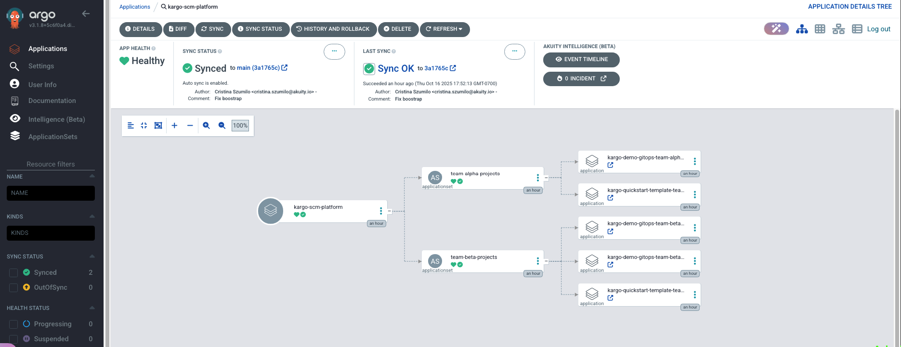
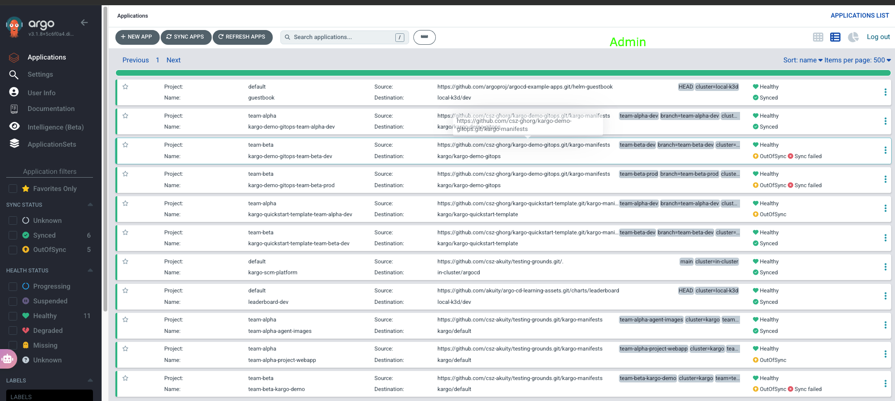

# ArgoCD Multi-Team Setup with SCM Provider Generator and Okta SSO

This repository contains the example configuration for a multi-team ArgoCD setup using Akuity (managed ArgoCD) with Okta SSO integration and team-based access control.

## Overview

This setup provides:

- **Team isolation** - Each team can only see and manage their own applications
- **Okta SSO integration** - Centralized authentication through Okta
- **SCM Provider Generator** - Automatic discovery of repositories and branches
- **Repository-specific projects** - Each repository gets its own ArgoCD project
- **Branch-based filtering** - Teams work on specific branch patterns

## Architecture

```
┌─────────────────┐    ┌──────────────────┐    ┌─────────────────┐
│   SSO           │    │   Akuity ArgoCD  │    │   GitHub Org    │
│                 │    │                  │    │                 │
│ • okta-team-    │◄──►│ • 4 Projects     │◄──►│ • kargo-demo-   │
│   alpha         │    │ • RBAC Policies  │    │   gitops        │
│ • okta-team-    │    │ • Team Isolation │    │ • kargo-quick-  │
│   beta          │    │ • SCM Generator  │    │   start-template│
│ • okta-admins   │    │                  │    │ • Team Branches │
└─────────────────┘    └──────────────────┘    └─────────────────┘
```

### Repository Structure

This repository automatically deploys ApplicationSets for each target repository:

- **Bootstrap Application**: `kargo-scm-platform` deploys all ApplicationSets
- **Target Repositories**:
  - `kargo-demo-gitops` → Creates `team-alpha-demo` and `team-beta-demo` projects
  - `kargo-quickstart-template` → Creates `team-alpha-quickstart` and `team-beta-quickstart` projects

## Project Structure

### Team Alpha Projects

- **Okta Group**: `okta-team-alpha`
- **ArgoCD Projects**:
  - `team-alpha-demo` (for kargo-demo-gitops repository)
  - `team-alpha-quickstart` (for kargo-quickstart-template repository)
- **Branch Pattern**: `team-alpha-*`
- **Access**: Only applications in their assigned projects

### Team Beta Projects

- **Okta Group**: `okta-team-beta`
- **ArgoCD Projects**:
  - `team-beta-demo` (for kargo-demo-gitops repository)
  - `team-beta-quickstart` (for kargo-quickstart-template repository)
- **Branch Pattern**: `team-beta-*`
- **Access**: Only applications in their assigned projects

### Admins

- **Okta Group**: `okta-admins`
- **Access**: Full access to all applications and projects

## Files Overview

### ApplicationSet Configuration

- `appset-scm-team-alpha-demo.yaml` - ApplicationSet for kargo-demo-gitops team-alpha branches
- `appset-scm-team-beta-demo.yaml` - ApplicationSet for kargo-demo-gitops team-beta branches
- `appset-scm-team-alpha-quickstart.yaml` - ApplicationSet for kargo-quickstart-template team-alpha branches
- `appset-scm-team-beta-quickstart.yaml` - ApplicationSet for kargo-quickstart-template team-beta branches
- `appset-scm-template.yaml` - Template for creating new team ApplicationSets

### Bootstrap Configuration

- `argocd-bootstrap-scm.yaml` - Bootstrap application that deploys all ApplicationSets

## ApplicationSet Configuration

Each ApplicationSet uses the SCM Provider Generator to automatically discover specific repositories and branches:

### Example: Team Alpha Demo ApplicationSet

```yaml
spec:
  generators:
    - scmProvider:
        github:
          organization: csz-ghorg # Github Org
          allBranches: true
        filters:
          - repositoryMatch: ^kargo-demo-gitops$  # Specific repository
            pathsExist: [kargo-manifests]
            branchMatch: ^team-alpha-.*$          # Team-specific branches
  template:
    metadata:
      name: '{{ .repository }}-{{ .branch }}'
    spec:
      project: team-alpha-demo  # Repository-specific project
      source:
        repoURL: '{{ .url }}'
        targetRevision: '{{ .branch }}'
        path: kargo-manifests
```

### Key Features

- **Repository-Specific**: Each ApplicationSet targets exactly one repository
- **Project Isolation**: Each repository gets its own ArgoCD project
- **Branch Filtering**: Only branches matching the team pattern are picked up
- **Path Filtering**: Only repositories with `kargo-manifests` directory
- **Automatic Discovery**: New branches are automatically discovered and deployed

## Okta SSO Configuration

### Required Okta Groups

Create these groups in your Okta Admin Console:

- `okta-team-alpha`
- `okta-team-beta`
- `okta-admins`

### OIDC Application Setup

1. Create an OIDC Web Application in Okta
2. Configure redirect URI: `https://your-akuity-instance.akuity.cloud/api/dex/callback`
3. Add group claims to the ID token
4. Assign users to appropriate groups

### Akuity Dashboard Configuration

In the Akuity dashboard, configure:

- **SSO**: OpenID Connect with Okta
- **RBAC**: Team-specific access policies (see RBAC section below)

## RBAC Configuration

The RBAC policy is configured in the Akuity dashboard under **Settings** → **RBAC Configuration**:

```csv
# Admin users - full access
p, role:admin, applications, *, */*, allow
p, role:admin, clusters, *, *, allow
p, role:admin, repositories, *, *, allow
p, role:admin, projects, *, *, allow
p, role:admin, certificates, *, *, allow
p, role:admin, accounts, *, *, allow
p, role:admin, gpgkeys, *, *, allow
p, role:admin, logs, *, *, allow
p, role:admin, exec, *, *, allow
p, role:admin, events, *, *, allow
p, role:admin, applicationSets, *, */*, allow

# Team Alpha - access to team-alpha-demo and team-alpha-quickstart projects
p, role:team-alpha, applications, get, team-alpha-demo/*, allow
p, role:team-alpha, applications, list, team-alpha-demo/*, allow
p, role:team-alpha, applications, watch, team-alpha-demo/*, allow
p, role:team-alpha, applications, sync, team-alpha-demo/*, allow
p, role:team-alpha, applications, action/*, team-alpha-demo/*, allow
p, role:team-alpha, applications, get, team-alpha-quickstart/*, allow
p, role:team-alpha, applications, list, team-alpha-quickstart/*, allow
p, role:team-alpha, applications, watch, team-alpha-quickstart/*, allow
p, role:team-alpha, applications, sync, team-alpha-quickstart/*, allow
p, role:team-alpha, applications, action/*, team-alpha-quickstart/*, allow
p, role:team-alpha, projects, get, team-alpha-demo, allow
p, role:team-alpha, projects, list, team-alpha-demo, allow
p, role:team-alpha, projects, watch, team-alpha-demo, allow
p, role:team-alpha, projects, get, team-alpha-quickstart, allow
p, role:team-alpha, projects, list, team-alpha-quickstart, allow
p, role:team-alpha, projects, watch, team-alpha-quickstart, allow
p, role:team-alpha, repositories, get, *, allow
p, role:team-alpha, repositories, list, *, allow
p, role:team-alpha, repositories, watch, *, allow
p, role:team-alpha, events, get, team-alpha-demo/*, allow
p, role:team-alpha, events, list, team-alpha-demo/*, allow
p, role:team-alpha, events, watch, team-alpha-demo/*, allow
p, role:team-alpha, events, get, team-alpha-quickstart/*, allow
p, role:team-alpha, events, list, team-alpha-quickstart/*, allow
p, role:team-alpha, events, watch, team-alpha-quickstart/*, allow
p, role:team-alpha, logs, get, team-alpha-demo/*, allow
p, role:team-alpha, logs, list, team-alpha-demo/*, allow
p, role:team-alpha, logs, watch, team-alpha-demo/*, allow
p, role:team-alpha, logs, get, team-alpha-quickstart/*, allow
p, role:team-alpha, logs, list, team-alpha-quickstart/*, allow
p, role:team-alpha, logs, watch, team-alpha-quickstart/*, allow
p, role:team-alpha, exec, create, team-alpha-demo/*, allow
p, role:team-alpha, exec, create, team-alpha-quickstart/*, allow

# Team Beta - access to team-beta-demo and team-beta-quickstart projects
p, role:team-beta, applications, get, team-beta-demo/*, allow
p, role:team-beta, applications, list, team-beta-demo/*, allow
p, role:team-beta, applications, watch, team-beta-demo/*, allow
p, role:team-beta, applications, sync, team-beta-demo/*, allow
p, role:team-beta, applications, action/*, team-beta-demo/*, allow
p, role:team-beta, applications, get, team-beta-quickstart/*, allow
p, role:team-beta, applications, list, team-beta-quickstart/*, allow
p, role:team-beta, applications, watch, team-beta-quickstart/*, allow
p, role:team-beta, applications, sync, team-beta-quickstart/*, allow
p, role:team-beta, applications, action/*, team-beta-quickstart/*, allow
p, role:team-beta, projects, get, team-beta-demo, allow
p, role:team-beta, projects, list, team-beta-demo, allow
p, role:team-beta, projects, watch, team-beta-demo, allow
p, role:team-beta, projects, get, team-beta-quickstart, allow
p, role:team-beta, projects, list, team-beta-quickstart, allow
p, role:team-beta, projects, watch, team-beta-quickstart, allow
p, role:team-beta, repositories, get, *, allow
p, role:team-beta, repositories, list, *, allow
p, role:team-beta, repositories, watch, *, allow
p, role:team-beta, events, get, team-beta-demo/*, allow
p, role:team-beta, events, list, team-beta-demo/*, allow
p, role:team-beta, events, watch, team-beta-demo/*, allow
p, role:team-beta, events, get, team-beta-quickstart/*, allow
p, role:team-beta, events, list, team-beta-quickstart/*, allow
p, role:team-beta, events, watch, team-beta-quickstart/*, allow
p, role:team-beta, logs, get, team-beta-demo/*, allow
p, role:team-beta, logs, list, team-beta-demo/*, allow
p, role:team-beta, logs, watch, team-beta-demo/*, allow
p, role:team-beta, logs, get, team-beta-quickstart/*, allow
p, role:team-beta, logs, list, team-beta-quickstart/*, allow
p, role:team-beta, logs, watch, team-beta-quickstart/*, allow
p, role:team-beta, exec, create, team-beta-demo/*, allow
p, role:team-beta, exec, create, team-beta-quickstart/*, allow

# Group mappings - Okta groups to ArgoCD roles
g, okta-team-alpha, role:team-alpha
g, okta-team-beta, role:team-beta
g, okta-admins, role:admin

# Default policy - DENY access by default
policy.default: ''
```

## Screenshots

> **Note**: To add the actual screenshots, save the images you have to the `images/` directory with the following names:

### ArgoCD Applications Dashboard - Team Alpha View


*Team Alpha users can only see applications in their assigned projects: `team-alpha-demo` and `team-alpha-quickstart`*

### ArgoCD Applications Dashboard - Team Beta View  


*Team Beta users can only see applications in their assigned projects: `team-beta-demo` and `team-beta-quickstart`*

### ArgoCD Application Dependency Graph


*The `kargo-scm-platform` application manages ApplicationSets that generate applications for each team and repository*

### Full Applications List (Admin View)


*Admin users can see all applications across all projects and teams*

**To add screenshots:**

1. Save your screenshots to the `images/` directory
2. Name them exactly as referenced above
3. The images will automatically display in the README

## Deployment

### 1. Deploy ApplicationSets

```bash
# Deploy the bootstrap application
kubectl apply -f argocd-bootstrap-scm.yaml

# Or deploy individual ApplicationSets
kubectl apply -f appset-scm-team-alpha.yaml
kubectl apply -f appset-scm-team-beta.yaml
```

### 2. Configure Akuity

1. Set up Okta SSO in Akuity dashboard
2. Configure RBAC policies in Akuity dashboard
3. Test with users from different Okta groups

### 3. Verify Setup

- Team Alpha users should only see applications in `team-alpha-demo` and `team-alpha-quickstart` projects
- Team Beta users should only see applications in `team-beta-demo` and `team-beta-quickstart` projects
- Admin users should see all applications across all projects

## Adding New Teams

To add a new team (e.g., team-charlie):

1. **Create Okta Group**: `okta-team-charlie`
2. **Create ApplicationSet**:

   ```bash
   cp appset-scm-template.yaml appset-scm-team-charlie.yaml
   sed -i 's/{{TEAM_NAME}}/team-charlie/g' appset-scm-team-charlie.yaml
   ```

3. **Add RBAC Policy**:

   ```csv
   # Team Charlie - access ONLY to applications with "team-charlie" in the name
   p, role:team-charlie, applications, get, *team-charlie*, allow
   p, role:team-charlie, applications, list, *team-charlie*, allow
   p, role:team-charlie, applications, watch, *team-charlie*, allow
   p, role:team-charlie, applications, sync, *team-charlie*, allow
   p, role:team-charlie, applications, action/*, *team-charlie*, allow
   p, role:team-charlie, projects, get, team-charlie, allow
   p, role:team-charlie, projects, list, team-charlie, allow
   p, role:team-charlie, projects, watch, team-charlie, allow
   p, role:team-charlie, repositories, get, *, allow
   p, role:team-charlie, repositories, list, *, allow
   p, role:team-charlie, repositories, watch, *, allow
   p, role:team-charlie, events, get, *team-charlie*, allow
   p, role:team-charlie, events, list, *team-charlie*, allow
   p, role:team-charlie, events, watch, *team-charlie*, allow
   p, role:team-charlie, logs, get, *team-charlie*, allow
   p, role:team-charlie, logs, list, *team-charlie*, allow
   p, role:team-charlie, logs, watch, *team-charlie*, allow
   p, role:team-charlie, exec, create, *team-charlie*, allow
   
   # Add group mapping
   g, okta-team-charlie, role:team-charlie
   ```

4. **Deploy**:

   ```bash
   kubectl apply -f appset-scm-team-charlie.yaml
   ```

## Troubleshooting

### Users Can See All Applications

- Check that RBAC policy is applied in Akuity dashboard
- Verify `policy.default: ''` (empty) is set
- Confirm users are assigned to correct Okta groups

### Users Can't See Any Applications

- Verify Okta group claims are configured correctly
- Check that group names match exactly (`okta-team-alpha`, etc.)
- Test with temporary permissive RBAC policy

### ApplicationSets Not Creating Applications

- Check branch naming matches regex patterns
- Verify repositories have `kargo-manifests` directory
- Check ArgoCD logs for SCM provider errors

### SSO Authentication Issues

- Verify redirect URI matches exactly: `/api/dex/callback`
- Check Okta application configuration
- Review Akuity SSO configuration

## Security Considerations

- **Default Deny**: No default access granted
- **Principle of Least Privilege**: Teams only see their own resources
- **Group-Based Access**: Centralized through Okta groups
- **Audit Trail**: All actions logged through ArgoCD

## Monitoring

- Monitor ArgoCD logs for authentication failures
- Track application sync status per team
- Review RBAC policy effectiveness
- Monitor Okta group membership changes
